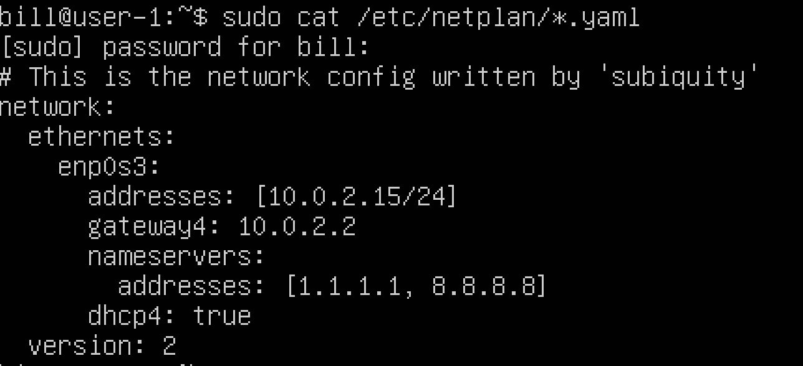
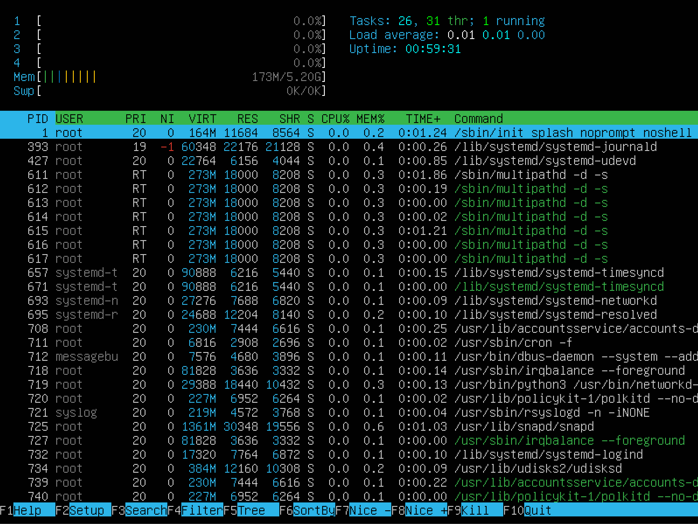
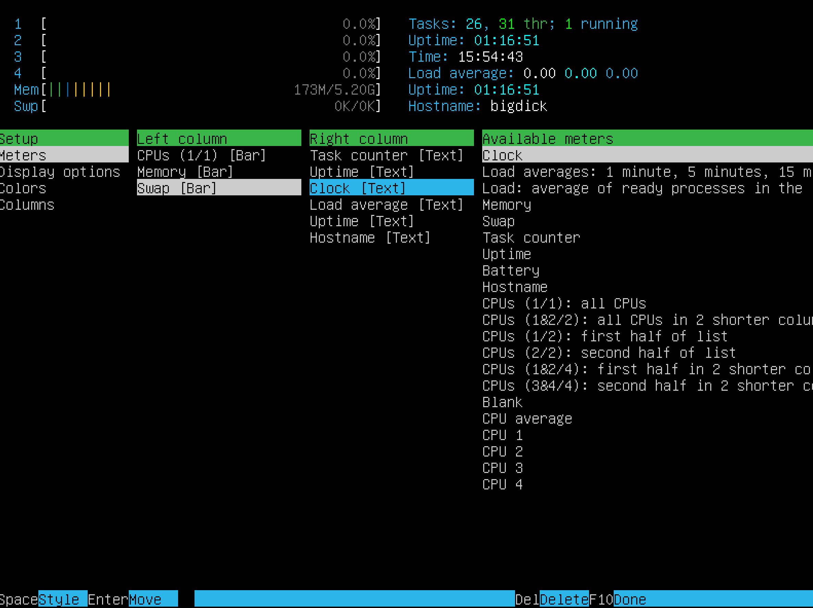
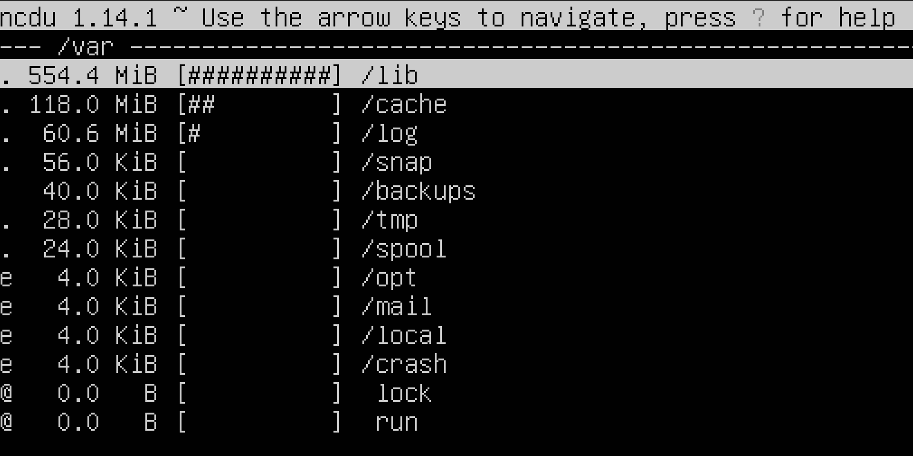

# Операционные системы UNIX/Linux /// ЭТО База.

# Part 1. Установка ОС - screenshot с командой cat /etc/issue

`-` Информация при загрузке

`-` Команда выводит версию операционной системы.

# Part 2. Создание пользователя

`-` Команда sudo adduser "username" создает пользователя в группе adm.

`-` Команда добавляет пользователя в группу adm.

`-` Команда котопесает пользователя которого мы только-что обработали из passwd.

# Part 3. Настройка сети ОС

#### Задаю название машины вида user-1.

#### Устанавливаю временную зону соответствующую твоему текущему местоположению.
  
#### Вывожу названия сетевых интерфейсов с помощью консольной команды.

---

- Интерфейс lo (loopback interface) — это специальный сетевой интерфейс, используемый для связи внутри самого устройства. Он предназначен для тестирования сетевого ПО и обмена данными между процессами на одном и том же хосте без необходимости использования физического сетевого интерфейса. 

---
#### Используя консольную команду, получаю ip адрес устройства, на котором работаю, от DHCP сервера. 

---

- DHCP (англ. Dynamic Host Configuration Protocol — протокол динамической настройки узла) — сетевой протокол, позволяющий сетевым устройствам автоматически получать IP-адрес и другие параметры, необходимые для работы в сети TCP/IP.

---  
#### Определяю и вывожу на экран внешний ip-адрес шлюза (ip) и внутренний IP-адрес шлюза, он же ip-адрес по умолчанию (geteway). 

#### Задю вручную настройки ip, gw, dns (используй публичный DNS серверы, например 1.1.1.1 или 8.8.8.8).  

#### Перезагружаю виртуальную машину, убедившись что статичные сетевые настройки (ip, gw, dns) соответствуют заданным в предыдущем пункте.  

#### Все на месте.

---
# Part 4. Обновление ОС

#### Обновляю пакетный манагер и системные пакеты до последней на момент выполнения задания версии. 

#### Проверяю что обновление прошло успешно.
---

## Part 5 . Права пользователей.

##### Разрешаю пользователю, созданному в [Part 2](#part-2-создание-пользователя) выполнять команду sudo.

- Команда sudo (от англ. "superuser do") используется в Unix-подобных операционных системах для выполнения команд с привилегиями суперпользователя (root). Это позволяет обычным пользователям выполнять задачи, требующие повышенных прав доступа, без необходимости входа в систему под учетной записью root.

##### Меняю имя хоста.
---

## Part 6. Установка и настройка службы времени

- "sudo apt install systemd-timesyncd"
- "sudo systemctl start systemd-timesyncd" 
- "sudo systemctl enable systemd-timesyncd"
- "sudo systemctl status systemd-timesyncd"

## Part 7. Установка и использование текстовых редакторов 

#### Прописываю starkilg 3мя редакторами и сохраняю.
ESC , :wq

CTRL+X, Enter

CTRL+K, X

#### Прописываю "21 School 21" но выхожу без сохранения.
ESC , :q! , ENTER

CTRL+X , N

CTRL+C , Y

####  Пробую функции поиска по содержимому файла (слово) и заменяю на любое другое и сохоаняю.

Простая замена vim:
- Введите :s для замены подстроки в текущей строке.
- Пример: для замены old на new в текущей строке, введите:
*     :s/old/new 

nano
-Нажмите Ctrl + \ (где \ означает "Replace") для вызова команды замены.

joe
Нажмите Ctrl + K и затем F (где F означает "Find") для вызова команды поиска, затем R.

___

# Part 8. Установка и базовая настройка сервиса **SSHD**

**== Задание ==**

#### Установливаю службу SSHd.
*     sudo apt update
*     sudo apt install openssh-server 
#### Добавляю автостарт службы при загрузке системы.
*     sudo systemctl start ssh
*     sudo systemctl enable ssh 
#### Перенастраиваю службу SSHd на порт 2022.
*     sudo nano /etc/ssh/sshd_config
- был Port 22, стал Port 2022

#### Используя команду ps, показываю наличие процесса sshd. 

- ps: Команда для отображения информации о текущих процессах.
- a: Этот ключ показывает процессы, запущенные всеми пользователями, а не только текущим пользователем.
- u: Этот ключ выводит процессы в удобочитаемом формате, показывая имя пользователя, который запустил процесс, а также используемую память и CPU.
- x: Этот ключ показывает процессы, которые не связаны с терминалом
#### Перезагружаю систему ssh.
*     sudo systemctl restart ssh

- Команда netstat -tan используется для отображения сетевых соединений. Опции -tan имеют следующее значение:
- -t означает, что отображаются только TCP соединения.
- -a означает, что отображаются все активные соединения.
- -n означает, что IP-адреса и номера портов отображаются в числовом формате, а не в виде имен хостов или названий служб.
- Вывод команды netstat -tan состоит из нескольких столбцов:
- Proto - Протокол соединения (TCP или UDP).
- Recv-Q и Send-Q - Количество пакетов, находящихся в очереди на получение или отправку.
- Local Address - Локальный IP-адрес и порт, которые используются для соединения.
- Foreign Address - Удаленный IP-адрес и порт, с которыми установлено соединение. Если соединение слушает, то вместо этого будет указан символ *.
- State - Состояние TCP соединения (например, LISTEN, ESTABLISHED).
- 0.0.0.0 в контексте этой команды означает, что соединение слушает на всех доступных сетевых интерфейсах, а не только на одном конкретном IP-адресе. Если бы здесь был указан конкретный IP-адрес, это означало бы, что соединение слушает только на этом IP-адресе.

---
# Part 9. Установка и использование утилит **top**, **htop**

- По выводу команд определяю и пишу в отчёте:
- uptime 39 минуточек примерно
- количество авторизованных пользователей = 1 штучка
- общую загрузка системы в диапазоне 0.0 - 0.9 %
- общее количество процессов 1673
- загрузку cpu 0.0 - 0.7 %
- загрузку памяти 0.0 - 0.7 % or 173M
- pid процесса занимающего больше всего памяти

- pid процесса, занимающего больше всего процессорного времени

- В отчёт вставляю скрин с выводом команды htop:
PID sorted

PERCENT_CPU sorted

PERCENT_MEM sorted

TIME sorted

- filtered для процесса sshd

- с процессом syslog, найденным, используя поиск 

F2
- с добавленным выводом hostname, clock и uptime 
 

# Part 10. Использование утилиты **fdisk**

- Название: /dev/sda
- Размер: 15.75 GiB, 16893656512 bytes, 32997376 sectors
**Разделы:**
- /dev/sda1
- /dev/sda2
- /dev/sda3
---

# Part 11. Использование утилиты **df** 

#### Запустил команду df.  
- В скриншоте для корневого раздела ты видишь (/):

- размер раздела size
- размер занятого пространства used
- размер свободного пространства avail
- процент использования use%
- Единица измерения в выводе чистого df килобайты но флаг -h (human readable конвертит в габонскую гадюку).  

#### Запустил команду df -Th.

- В скриншоте для корневого раздела ты видишь (/dev/mapper/ubuntu--vg-ubuntu--lv):

- размер раздела size
- размер занятого пространства used
- размер свободного пространства avail
- процент использования use %

- Тип файловой системы tmpfs

---

# Part 12. Использование утилиты **du**

#### Вывел размер папок /home, /var, /var/log (в человекочитаемом виде)

#### Вывел размер всего содержимого в /var/log (не общее, а каждого вложенного элемента, используя *)
---

# Part 13. Установка и использование утилиты **ncdu**

#### Устанавливаю утилиту ncdu
*     sudo apt update
*     sudo apt install ncdu
#### Вывожу размер папок /home, /var, /var/log

- Размеры примерно совпадают с полученными в [Part 12](#part-12-использование-утилиты-du).

# Part 14. Работа с системными журналами

- Пишу в отчёте время последней успешной авторизации, имя пользователя и метод входа в систему;

- Перезапусти службу SSHd;

- Cкрин с сообщением о рестарте службы (найденный в логах).

# Part 15. Использование планировщика заданий **CRON**

#### Используя планировщик заданий, запускаю команду uptime через каждые 2 минуты.

- Список текущих заданий для CRON;

- Скрины со строчками о выполнении и списком текущих задач.

##### Удалил все задания из планировщика заданий.
*     crontab -r
*     crontab -l
---